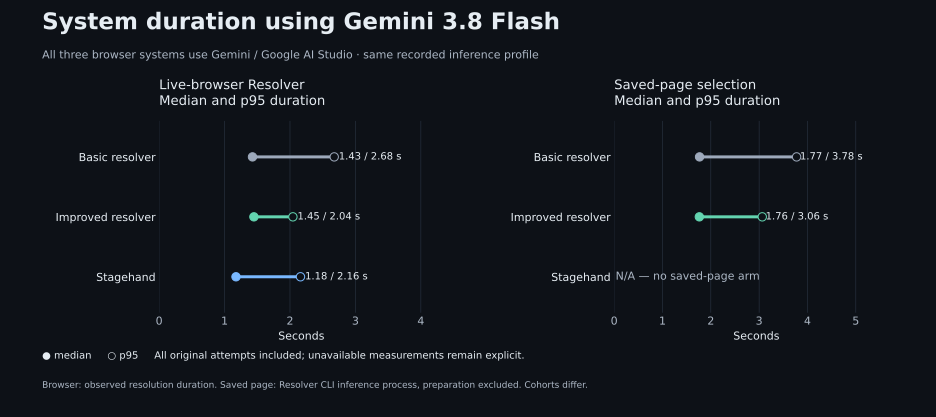

[](https://github.com/Mochib-Tech-Solutions/xpathed/actions/workflows/check.yml)


xpathed is a Resolver API that turns English instructions into verified XPath expressions for the current browser view. The Resolver is the core system. It uses a browser service through HTTP APIs; the included chat workspace is a client for manual testing and demonstrations.

**The model selects elements; browser code builds and verifies their XPaths.** Independent evaluation checks whether those elements were the intended targets.


On [Sauce Demo](https://www.saucedemo.com/), “Click the Login button” finds and highlights Login, then returns its verified XPath. The form stays untouched.

## Try an instruction

> Hover over OK under Employee.

xpathed uses section context to distinguish repeated buttons. On a page with suitable markup, an illustrative result is:

```text
Button · OK
Action: hover
XPath: //*[@aria-label='Employee']//button[normalize-space(.)='OK']
Verification: one match, same captured node, still in the current view
```

The actual XPath comes from the DOM. Results include readiness, time and cost. A blocked action appears as one red explanation naming the target and why the action is unavailable, without an XPath card or repeated state labels. In plural replies it keeps its numbered target card. Hover or focus a current result’s XPath to highlight only that element until exit, then restore all selected outlines. Singular requests with indistinguishable matching targets ask for a name, section or position; explicit plural requests enumerate the matching targets. You browse manually; the resolver highlights targets without executing the instruction.

Open Shadow DOM is supported, including nested and dynamically inserted controls. A found shadow target includes its ordered `shadowChain` beside the XPath; enter each host's open root, then evaluate the XPath within the final tree. Frame owners can carry shadow context too. Closed roots remain unsupported. See [locator context](docs/resolution.md#open-shadow-dom-and-locator-context).

Current-view capture retains every eligible candidate without application ceilings on candidate count, DOM scans, frame/shadow depth, text, bytes or capture time. Live model input includes the complete sanitized view; provider context capacity and transport failures remain explicit. See [the capture policy](docs/adr/0030-capture-the-complete-current-view.md).

Browser verifies each returned target’s retained node, name/text, current-view membership, unique XPath and fresh readiness. Unrelated carousel or widget changes do not invalidate it; selection and absence describe the captured view, with target-set completeness unverified. See [target revalidation](docs/resolution.md#target-revalidation). Explicit target counts are preserved: two found buttons out of three requested produce a partial result with one missing target.

XPath construction prefers explicit test attributes and meaningful semantics. It distinguishes sanitized names from DOM text so Unicode and nested labels can retain semantic locators across wrapper changes, while excluding hidden text and form values from new text predicates. The [selection policy](docs/resolution.md#preferred-xpath) describes the bounds and saved-locator limits.

Each sent prompt has a **Retry instruction** button that resends it against the active tab’s current view as a new attempt, preserving earlier results and the composer draft. Retry is disabled while the workspace is busy.

The chat header’s **Reset chat** asks for confirmation before clearing the active tab’s draft and results. Cancel or Escape preserves the chat; confirming keeps the browser page and other tabs.

## Clone and run locally

Install **Node 24.16.0**, **pnpm 12.8.1**, and **Docker with Compose and Buildx**. Chromium needs the [documented Linux sandbox support](docs/runtime.md#sandbox-and-supported-environment). Repository tooling checks additionally require Python 3.12 or later.

```sh
git clone https://github.com/Mochib-Tech-Solutions/xpathed.git
cd xpathed
pnpm run setup
```

Setup installs local `pre-commit` and `commit-msg` hooks. Conventional Commits validation runs through `commit-msg` only; see [local commit checks](docs/ci.md#local-commit-checks).

Setup creates an ignored `.env` from `.env.example` without replacing an existing file. Supply the application settings:

```dotenv
OPENROUTER_API_KEY=your-key-here
OPENROUTER_MODEL=google/gemini-3.8-flash
OPENROUTER_PROVIDER=google-ai-studio
```

```sh
pnpm dev
```

Open **[localhost:8080](http://localhost:8080)**, enter a website address and submit an instruction. Manual browsing works without a key; live resolution uses your OpenRouter account.

All four services run in Docker. Ctrl+C or `pnpm docker:down` removes development containers while preserving configuration. A separate checkout needs its own `COMPOSE_PROJECT_NAME`, `XPATHED_PORT` and `.env`.

## Hosted workspace

Main's classic branch protection requires independent review and CI checks for nonadministrators; administrators are exempt by owner choice. The recorded policy and live-setting verification are described in [security guidance](SECURITY.md).

The hosted workspace can follow successful `main` pushes through the change-aware deployment job. App changes build on the VPS, pass health checks and restore the previous images on failure; unchanged inputs skip rebuilding and restarting but still verify health. CI fails if deployment is unexpectedly skipped after successful checks. SSH settings and the deployment URL use Actions secrets; deployment output redacts addresses, while runtime provider credentials remain on the host. Keep real deployment addresses out of repository content. See [hosted deployment](docs/deployment.md) for setup, access and rollback behavior. This source deployment is separate from published-image releases.

ClientApi and Resolver limit shared API traffic to 120 requests per minute and eight concurrent requests per process. Resolver separately allows 20 model calls per minute, 1,000 per 24-hour window and two concurrent calls, without queuing or automatic retries. Configure these positive limits in `.env`; [runtime limits](docs/runtime.md#backend-and-model-usage-limits) describe rejection and accounting. Counters reset on restart. Use a dedicated OpenRouter application key with a provider-side credit limit for a dollar spending cap.

For an anonymous public workspace, also install the [hosted security profile](docs/deployment.md#public-browser-isolation): browser packet isolation with a fail-closed startup gate, container resource limits and HTTPS origin/header protection. This host policy is separate from local development and trusted evaluation, which can browse private fixtures.

## Architecture

The Resolver accepts instructions from a client or evaluation runner, coordinates capture and model selection, and returns targets verified by the browser service. Browser implementations connect through the [browser API contract](docs/runtime.md#browser-integration). The bundled implementation uses Playwright/Chromium.

[](docs/diagrams/system-design.svg)

The diagram includes the bundled test client.

| Service                       | Responsibility                                                                |
| ----------------------------- | ----------------------------------------------------------------------------- |
| Resolver — ASP.NET Core       | Core resolution API, model selection and orchestration                        |
| Browser — Playwright/Chromium | Browser API implementation: pages, capture, XPath verification and highlights |
| Web — React/TypeScript        | Manual test client: chat, tabs and noVNC viewer                               |
| ClientApi — ASP.NET Core      | Test-client requests                                                          |

Resolver runs independently of Web and ClientApi. It addresses Browser through `BrowserUrl`, exchanging serializable records defined in `src/Common`. A replacement browser service must preserve the capture, identity, verification and lifecycle contracts; only the bundled implementation has been verified. The test client's viewer and Resolver address the same managed page.

The repository follows these boundaries: `src/Resolver` contains the core system, `src/Browser` the browser implementation, `src/Common` the shared contracts, and `src/Web` plus `src/ClientApi` the test client. `evaluation/` evaluates the Resolver directly.

## How resolution works

[](docs/diagrams/resolver-internals.html)

The request crosses six boundaries. Each step uses the previous step's evidence and has a specific completion condition.

| Step and owner                       | Requires                                                    | Produces                                                                 |
| ------------------------------------ | ----------------------------------------------------------- | ------------------------------------------------------------------------ |
| 1. Accept — Resolver                 | Instruction, active page and current document ID            | Validated request                                                        |
| 2. Capture — Browser                 | Live page and supported frame documents                     | Complete scoped candidates, capture ID and retained nodes                |
| 3. Select — model through OpenRouter | Instruction, sanitized candidates, prompt and output schema | Shared action, candidate IDs and found/absent/unsupported outcomes       |
| 4. Validate — Resolver               | Model output and the captured candidate set                 | Schema-checked selection with valid IDs and no duplicates                |
| 5. Verify — Browser                  | Capture ID, selections and retained live nodes              | Unique same-node XPath, frame context, current-view checks and readiness |
| 6. Return — Resolver                 | Verified Browser observations and provider usage            | API result with target outcomes, limitations, timings and cost           |

Saved-page selection evaluates steps 3–4 with saved inputs. XPath construction and verification covers step 5. Live-browser Resolver covers the complete request. The model has no browser tools and returns element IDs; Browser constructs the XPath. XPath construction prefers verified explicit test contracts on the target or its unique container before display wording. Those anchors tolerate localization and wrappers; semantic and structural fallbacks retain their documented limits. See the [XPath selection policy](docs/resolution.md#preferred-xpath). Repeated item cards remain selectable alongside their child controls. Parent identities and a compact layout index describe measured above/below/left/right neighbors while retaining the complete candidate input; see [spatial item context](docs/resolution.md#spatial-item-context). The [walkthrough](docs/how-it-works.md#step-boundaries) explains the limits and failure conditions at each handoff.

### Model and configuration

The development default is **`google/gemini-3.8-flash` through OpenRouter's `google-ai-studio` provider with low reasoning**, configured in `.env.example` and `docker/compose.yaml`. Existing `.env` and hosted runtime settings take precedence; update both model and provider there to adopt this default.

Switch models by setting both values in the ignored `.env`, then restart this checkout with `pnpm dev`. Hosted deployments use their private `deploy/application.env` instead. The prompt and resolution contract stay the same.

| `OPENROUTER_MODEL`             | `OPENROUTER_PROVIDER` | Effective reasoning          |
| ------------------------------ | --------------------- | ---------------------------- |
| `google/gemini-3.8-flash`      | `google-ai-studio`    | Low; reasoning text excluded |
| `deepseek/deepseek-v4.1-flash` | `wafer`               | Disabled                     |
| `openai/gpt-6-luna`            | `openai`              | Disabled                     |

The repository keeps one implementation and one prompt/schema, updated in place. Git tracks their history; code has no manual prompt or behavior revision numbers. See [ADR-0024](docs/adr/0024-keep-one-resolution-implementation.md).

`ActionSelectionStrategy` owns the shared runtime and saved-page prompt, schema and selection validation. `OpenRouterGateway` pins the provider, enables low reasoning for Gemini 3.8 Flash while excluding reasoning from returned text, disables reasoning for other models, disables fallback, and limits output to 4,096 tokens. A configuration hash identifies effective settings. No model is trained here; changes to the pretrained model, prompt or context require evaluation. Docker/environment variables supply OpenRouter credentials, endpoint, model and provider. Release artifacts do not override deployment configuration.

Illustrative saved click result:

```text
Target: Save in Profile
XPath: verified against the selected button
Readiness: blocked — button disabled
```

## Scope

Resolve one English action across one or more current-view targets, including nested iframe and open-shadow targets. Off-screen elements require manual scrolling and another request. Mixed actions, sequential workflows, closed shadow roots and image-pixel interpretation are unsupported. Readiness describes observed state, not successful execution.

This is a local application. Hosted use needs authentication, network isolation and session capacity management.

## Evaluation

The **evaluation set** has three categories, scored separately:

| Category                            | What it checks                                                                                                         | Command                       |
| ----------------------------------- | ---------------------------------------------------------------------------------------------------------------------- | ----------------------------- |
| Saved-page selection                | Real model selects the expected element from reviewed saved candidates, currently PhraseNode                           | `pnpm evaluate:model:live`    |
| XPath construction and verification | Controlled selections go directly to Browser; independent DOM labels check XPath identity, state and locator mutations | `pnpm evaluate:xpath`         |
| Live-browser Resolver               | Instruction → real browser capture → real model → verified XPath and final response                                    | `pnpm evaluate:resolver:live` |

`pnpm evaluate` runs all three and writes separate results plus a combined summary. **It makes paid model calls** for Saved-page selection and Live-browser Resolver; XPath evaluation needs no provider key. Commands using live provider inference use `OPENROUTER_EVAL_API_KEY`. Fetch the reviewed inputs with `pnpm datasets:collection fetch` if they are not already available. The active archive contains only the 569 admitted saved-page cases; the original 1,084-case source archive and the audit explaining 515 exclusions remain available for traceability. Imported accuracy cases also require a pinned semantic review of the expected target against the supplied input; ambiguous or unanswerable labels remain documented exclusions. See the [dataset review contract](docs/evaluation.md#private-dataset-collection).

Saved-page selection calls a real model using saved page inputs. Live-browser Resolver uses a real Chromium page; its provider mode can be controlled (provider-free) or live (paid inference). XPath evaluation supplies known selections to isolate the stage after inference. Live-browser Resolver checks whether both stages work together. The chat UI is outside this boundary. A **regression** is a lost pass between compared runs. Reusing cases does not establish unseen-site accuracy.

Shared XPath/Resolver case names and browser/pipeline test titles describe their group and behavior, for example `targeting-save-button-by-name` and `scope-offscreen-target-is-absent`. See the [evaluation guide](docs/evaluation.md#one-evaluation-set-grouped-by-behavior) for naming and provenance.

### Example evaluation cases

These are actual cases from the shared evaluation set. Expected selectors belong to the independent grader; the model never receives them.

| Instruction                                            | Expected result                                                       | What it checks                                  |
| ------------------------------------------------------ | --------------------------------------------------------------------- | ----------------------------------------------- |
| “Click Save changes.”                                  | The labelled Save button, with a unique same-node XPath               | Target selection and XPath identity             |
| “Click all Approve buttons in Approvals.”              | Both buttons, including the disabled one; its readiness is blocked    | Exact target-set completeness and readiness     |
| “Click Help.” with Help off-screen                     | `not_found` in the current view                                       | Scoped absence in Live-browser Resolver         |
| “Fill Notes.” with readonly Notes                      | Found target, `fill` action, blocked readiness with reason `readonly` | Action interpretation and passive state         |
| “Click Save changes in Profile.” then insert a wrapper | The saved XPath still identifies the intended button                  | Locator reuse in deterministic XPath evaluation |

See [case IDs, fixtures and metric definitions](docs/evaluation.md#example-cases-and-metrics), and [actual outcomes across the three systems](docs/research/clean-evaluation-comparison.md#case-examples).

### 1. Select the model using accuracy

We first compared **DeepSeek, Luna and Gemini with the same enhanced Resolver**, prompt/schema and evaluation inputs at measured source `d444176c`. Each model completed **190 browser cases and 569 reviewed saved-page cases**, with one original attempt and no retries. Gemini had the highest observed accuracy in both categories, so we selected it as the application default.

| Model / pinned provider                              | Browser action + targets | Saved-page exact-target selection |
| ---------------------------------------------------- | ------------------------ | --------------------------------- |
| DeepSeek V4.1 Flash / Wafer                          | 176/190 (92.6%)          | 481/569 (84.5%)                   |
| GPT-6 Luna / OpenAI                                  | 183/190 (96.3%)          | 512/569 (90.0%)                   |
| Gemini 3.8 Flash / Google AI Studio (reasoning: low) | 190/190 (100.0%)         | 547/569 (96.1%)                   |

[](docs/research/model-comparison-2026-10-04.md)

Gemini requires low reasoning; DeepSeek and Luna disable reasoning. The earlier model-selection experiment supplied Gemini's compatible reasoning setting through a recorded adapter. The current application supplies it directly, and real Gemini browser and chat checks passed. The [model-selection report](docs/research/model-comparison-2026-10-04.md) retains the original source, paired gains/losses, durations, costs and evidence. Its measurements stay separate from the approach comparison below. The model decision is based on observed accuracy on this evaluation set; timing cohorts differ.

### 2. Compare approaches using the selected Gemini model

With **Gemini 3.8 Flash / Google AI Studio and low reasoning held constant**, we then compare **Basic, Enhanced (Improved), and Stagehand**. Enhanced is the implementation used by the application. Measured runtime `1cc50794`, archived Basic `d5333779`, Stagehand **4.1.0**. All **190 shared browser cases** and **569 reviewed saved-page cases per applicable arm** completed with one original attempt and no retries. Stagehand requires a live page and has no saved-page arm.

| System            | Saved-page exact-target selection | Browser action + targets |
| ----------------- | --------------------------------- | ------------------------ |
| Basic resolver    | 532/569 (93.5%)                   | 182/190 (95.8%)          |
| Improved resolver | 551/569 (96.8%)                   | 190/190 (100.0%)         |
| Stagehand         | Not applicable                    | 123/190 (64.7%)          |

[](docs/research/clean-evaluation-comparison.md)

Basic → Improved: **8 browser gains / 0 lost passes**, **27 saved-page gains / 8 lost passes**. Controlled XPath: **180/180**, including **22/22 saved-locator mutations** and **22/22 fresh resolutions after mutation**, with no model calls. Scores have separate denominators.

[](docs/research/clean-evaluation-comparison.md#duration-and-cost)

The approach comparison retains **1,708 original requests**, **$12.70015050 known reported cost** and **0 unreported charges**. Tables, accuracy and duration figures use the [same verified aggregate](docs/assets/evaluation/clean-comparison.json). The [report](docs/research/clean-evaluation-comparison.md) separates common, target-only and full-contract scores, behavior categories and timing cohorts. Basic's archived request needs a reasoning-only compatibility adaptation; Improved and Stagehand send Gemini settings directly. Earlier comparisons and incomplete runs remain separate evidence and are not pooled into these scores. See the [presentation statistics](docs/research/presentation-statistics.md) for the figures and their measurement boundaries.

```sh
pnpm check                              # local checks
pnpm evaluate                           # all three categories, including paid model calls
pnpm evaluate:resolver                  # complete pipeline with controlled model responses
pnpm evaluate:xpath -- --case targeting-save-button-by-name # one XPath case, no model call
pnpm evaluate:replay RUN_DIRECTORY       # regrade saved evidence
```

Category commands accept `--case CASE_ID` and `--output DIRECTORY`. `pnpm evaluate -- --output DIRECTORY` stores each category beneath that directory. Live-browser Resolver with a controlled provider uses up to four isolated sessions; `--concurrency 1` selects serial timing. Category runs with live provider inference are serial. CI uses `evaluate:resolver` and stays provider-free. The other apps' unit and integration commands are unchanged.

Ordinary CI stays provider-free. A source merge validates the selected implementation; recorded evaluation results retain their own source, cases and grading identities.

## Codebase graph

The repository includes a Graphify plugin in the **xpathed tools** local marketplace.
Install it with `codex plugin marketplace add .` followed by
`codex plugin add graphify@xpathed-tools`, then invoke `$graphify` in the app.
Its [skill](.agents/plugins/graphify/skills/graphify/SKILL.md) uses the official
Graphify CLI for a local code-only map and keeps generated views under ignored
`.artifacts/graphify/`. Structural connections need source confirmation; docs and
images are outside this view.

## Read more

See [security and contribution protection](SECURITY.md) for credential handling, the history scan and required PR-review policy.

- [System walkthrough](docs/how-it-works.md): request flow and integration.
- [Engineering decisions](docs/engineering-journey.md): tradeoffs, quality and next steps.
- [Demo guide](docs/demo.md): present the working system.
- [Runtime](docs/runtime.md) and [resolution contract](docs/resolution.md): API and configuration reference.
- [Evaluation](docs/evaluation.md): run, compare and replay retained evidence.

Imported-case review also binds the prepared model input after privacy sanitization. The host verifies this hash before provider inference; see the [prepared-input audit](docs/research/2026-10-03-prepared-input-audit.md).

## References and acknowledgements

- **PhraseNode** — Panupong Pasupat, Tian-Shun Jiang, Evan Liu, Kelvin Guu and Percy Liang. [_Mapping natural language commands to web elements_](https://aclanthology.org/D18-1540/), EMNLP 2018. This dataset supplies the saved-page target-selection cases. The [authors’ dataset page](https://nlp.stanford.edu/projects/phrasenode/) licenses crowdsourced commands under [CC BY 4.0](https://creativecommons.org/licenses/by/4.0/) and processed pages under [ODC-By 1.0](https://opendatacommons.org/licenses/by/1-0/).
- **Mind2Web** — Xiang Deng, Yu Gu, Boyuan Zheng, Shijie Chen, Samuel Stevens, Boshi Wang, Huan Sun and Yu Su. [_Mind2Web: Towards a Generalist Agent for the Web_](https://arxiv.org/abs/2306.06070), NeurIPS 2023. Its [dataset](https://github.com/OSU-NLP-Group/Mind2Web#licensing-information) is licensed under CC BY 4.0. We used it for an import/adaptation pilot; it contributes no cases to the current saved-page comparison. See the [adaptation and provenance notes](docs/research/mind2web-import-feasibility.md).
- **Stagehand** — [Browserbase and the Stagehand contributors](https://github.com/browserbase/stagehand). Its observation API provides the independently graded browser comparison baseline described above.

Our imported cases are reviewed derivatives: page evidence is sanitized, candidate inputs are prepared for xpathed, and unsuitable labels are explicitly excluded. Original source identities, splits, checksums and review decisions remain recorded in the [dataset provenance and review](docs/evaluation.md#private-dataset-collection). These adapted results are not the datasets’ original published benchmark scores, and attribution does not imply endorsement by their authors.
