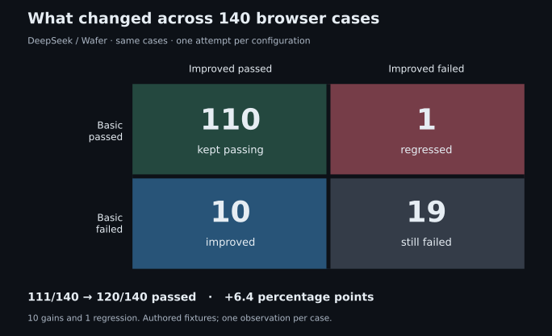

# A compass for the web.

[](https://github.com/Mochib-Tech-Solutions/xpathed/actions/workflows/check.yml)


xpathed turns English instructions into verified XPath expressions for the page in front of you. Chat, a live browser and highlighted targets share one workspace.

**The model selects elements; browser code builds and verifies their XPaths.** Independent evaluation checks whether those elements were the intended targets.

## Try an instruction

> Hover over OK under Employee.

xpathed uses section context to distinguish repeated buttons. On a page with suitable markup, an illustrative result is:

```text
Button · OK
Action: hover
XPath: //*[@aria-label='Employee']//button[normalize-space(.)='OK']
Verification: one match, same captured node, still in the current view
```

The actual XPath comes from the DOM. Results include readiness, time and cost. You browse manually; the resolver highlights targets without executing the instruction.

## Run locally

Install **Node 24.16.0**, **pnpm 12.8.1**, and **Docker with Compose and Buildx**. Chromium needs the [documented Linux sandbox support](docs/runtime.md#sandbox-and-supported-environment).

```sh
git clone https://github.com/Mochib-Tech-Solutions/xpathed.git
cd xpathed
pnpm run setup
```

Setup creates an ignored `.env`. Add your OpenRouter application key:

```dotenv
OPENROUTER_API_KEY=your-key-here
```

```sh
pnpm dev
```

Open **[localhost:8080](http://localhost:8080)**, enter a website address and submit an instruction. Manual browsing works without a key; live resolution uses your OpenRouter account.

All five services run in Docker. Ctrl+C or `pnpm docker:down` removes development containers while preserving configuration and database data. A separate checkout needs its own `COMPOSE_PROJECT_NAME`, `XPATHED_PORT` and `.env`.

## Architecture

[](docs/diagrams/system-design.svg)

| Service                       | Responsibility                                         |
| ----------------------------- | ------------------------------------------------------ |
| Web — React/TypeScript        | Chat, tabs, noVNC viewer and entry-point proxy         |
| ClientApi — ASP.NET Core      | Client requests and diagnostic recording               |
| Resolver — ASP.NET Core       | Candidate context, model selection and orchestration   |
| Browser — Playwright/Chromium | Live pages, capture, XPath verification and highlights |
| PostgreSQL                    | Diagnostic records and retained evidence               |

Viewer and resolver address the same managed page. Browser owns live nodes; Resolver has no database dependency.

## How resolution works

1. **Capture.** Browser assigns temporary IDs to eligible elements in the current view, with sanitized names, roles, context, state, geometry and supported CSS colors. Editable values, cookies and storage stay out. Exceeded capture budgets fail explicitly.
2. **Select.** One OpenRouter call receives the instruction and complete scoped candidate list. The model returns strict JSON with one shared interaction and distinct candidate IDs, or missing/unsupported outcomes. It has no browser tools.
3. **Validate.** Resolver checks the response schema, candidate membership, shared action and enumeration completeness.
4. **Verify.** Browser constructs XPath from test attributes and semantic anchors before structural fallback. Each XPath must uniquely match the retained node in its document. Frame context stays separate. Document and current-view membership are rechecked, including for absence.
5. **Return.** Browser observes readiness and highlights targets. Disabled or covered elements can still have valid XPaths. Web displays the result; ClientApi records the attempt.

### Model and configuration

The development default is **`deepseek/deepseek-v4.1-flash` through OpenRouter's `wafer` provider**, configured in `.env.example` and `docker/compose.yaml`. Runtime uses contract **4**, prompt **10**, capture **5** and XPath strategy **4**.

`ActionSelectionStrategy` owns the prompt/schema. `OpenRouterGateway` pins the provider, disables reasoning and fallback, and limits output to 4,096 tokens. A configuration hash identifies effective settings. No model is trained here; changes to the pretrained model, prompt or context require evaluation. Runtime defaults and approved release configurations are separate.

## Failure diagnostics

PostgreSQL keeps resolution results and sanitized evidence so failures can be investigated after a tab closes. ClientApi records each attempt; chat stays in the browser workspace. See [diagnostics](docs/diagnostics.md) for investigation tools.

Illustrative saved click result:

```text
Target: Save in Profile
XPath: verified against the selected button
Readiness: blocked — button disabled
```

## Scope

Resolve one English action across one or more current-view targets, including nested iframe targets. Off-screen elements require manual scrolling and another request. Mixed actions, sequential workflows, shadow-root XPath targets and image-pixel interpretation are unsupported. Readiness describes observed state, not successful execution.

This is a local application. Hosted use needs authentication, network isolation and session capacity management.

## Evaluation

Independent labels check target identity, complete target sets, action, XPath and readiness. Deterministic tests check the pipeline; live runs measure model behavior. Offline selection and browser results have separate denominators.

### Compare configurations on the same cases

Both configurations use **DeepSeek V4.1 Flash through Wafer**, with the same inference settings, cases and grader.

| Configuration       | What it tests                                                                                    | Correct browser cases |
| ------------------- | ------------------------------------------------------------------------------------------------ | --------------------: |
| Earlier — prompt 8  | Current-view selection and captured-target verification                                          |       111/140 (79.3%) |
| Current — prompt 10 | Clearer control/context distinctions, explicit scoped absence and stronger viewport revalidation |   **120/140 (85.7%)** |

The current configuration gained **10 passes and lost one**, a net **6.4 percentage-point increase**. This measures the combined changes; it does not isolate an individual prompt rule. The regression remains visible and would fail the release requirement to preserve every baseline pass.

[](docs/assets/evaluation/paired-outcomes.svg)

All **140 browser cases** received one original attempt per configuration:

| Category    | What it checks                                     | Cases |
| ----------- | -------------------------------------------------- | ----: |
| Targeting   | Names, roles and language variations               |    27 |
| Context     | Sections, repeated labels and relationships        |    51 |
| Cardinality | Complete sets of requested targets                 |     4 |
| Appearance  | CSS colors and relative positions                  |     5 |
| Scope       | Current view, absence and unsupported instructions |    19 |
| State       | Disabled, covered and partially visible controls   |    30 |
| Robustness  | Untrusted page text and large pages                |     2 |
| Frames      | Targets inside nested documents                    |     2 |

The separate **1,084-case offline collection** returned **716/1,084 (66.1%)** and **710/1,084 (65.5%)** exact results. Both arms use the same offline prompt and implementation: this measures repeat variation, not the browser changes. Every reviewed input retains its supplied candidates.

The [full comparison](docs/research/configuration-comparison.md) includes the category heatmap, remaining failures, timing by execution phase and recorded charges. All **2,448 arm attempts** are retained, including errors; none were retried.

```sh
pnpm check                              # local checks
pnpm evaluate                           # deterministic browser evaluation
pnpm evaluate:replay RUN_DIRECTORY       # regrade saved evidence
pnpm evaluate:live                      # paid OpenRouter evaluation
```

Live evaluation uses `OPENROUTER_EVAL_API_KEY`. Local checks run independent groups concurrently; browser evaluation uses isolated sessions with up to four workers. Use `pnpm evaluate -- --concurrency 1` for serial execution.

Release evaluation compares exact candidate and approved images on the complete reviewed collection. Activation is explicit; nightly monitoring reports drift without changing the running app.

## Read more

- [System walkthrough](docs/how-it-works.md): request flow, storage and integration.
- [Engineering decisions](docs/engineering-journey.md): tradeoffs, quality and next steps.
- [Demo guide](docs/demo.md): present the working system.
- [Runtime](docs/runtime.md) and [resolution contract](docs/resolution.md): API and configuration reference.
- [Evaluation](docs/evaluation.md) and [releases](docs/releases.md): run, compare and activate.
