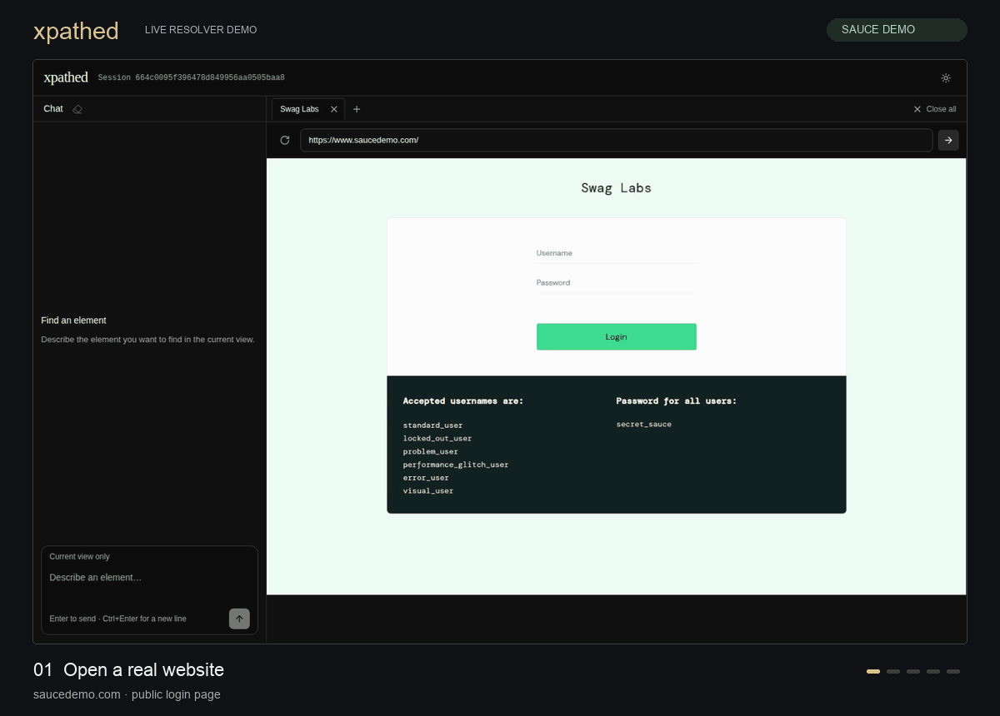
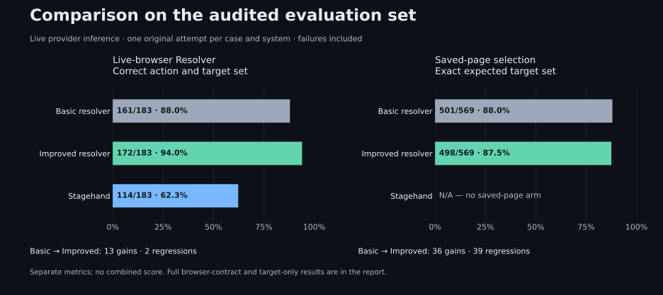

[](https://github.com/Mochib-Tech-Solutions/xpathed/actions/workflows/check.yml)


xpathed is a Resolver API that turns English instructions into verified XPath expressions for the current browser view. The Resolver is the core system. It uses a browser service through HTTP APIs; the included chat workspace is a client for manual testing and demonstrations.

**The model selects elements; browser code builds and verifies their XPaths.** Independent evaluation checks whether those elements were the intended targets.



On [Sauce Demo](https://www.saucedemo.com/), “Click the Login button” finds and highlights Login, then returns its verified XPath. The form stays untouched.

## Try an instruction

> Hover over OK under Employee.

xpathed uses section context to distinguish repeated buttons. On a page with suitable markup, an illustrative result is:

```text
Button · OK
Action: hover
XPath: //*[@aria-label='Employee']//button[normalize-space(.)='OK']
Verification: one match, same captured node, still in the current view
```

The actual XPath comes from the DOM. Results include readiness, time and cost. A blocked action appears as one red explanation naming the target and why the action is unavailable, without an XPath card or repeated state labels. You browse manually; the resolver highlights targets without executing the instruction.

XPath construction prefers explicit test attributes and meaningful semantics. It distinguishes sanitized names from DOM text so Unicode and nested labels can retain semantic locators across wrapper changes, while excluding hidden text and form values from new text predicates. The [selection policy](docs/resolution.md#preferred-xpath) describes the bounds and saved-locator limits.

The chat header’s **Reset chat** asks for confirmation before clearing the active tab’s draft and results. Cancel or Escape preserves the chat; confirming keeps the browser page and other tabs.

## Clone and run locally

Install **Node 24.16.0**, **pnpm 12.8.1**, and **Docker with Compose and Buildx**. Chromium needs the [documented Linux sandbox support](docs/runtime.md#sandbox-and-supported-environment). Repository tooling checks additionally require Python 3.12 or later.

```sh
git clone https://github.com/Mochib-Tech-Solutions/xpathed.git
cd xpathed
pnpm run setup
```

Setup creates an ignored `.env` from `.env.example` without replacing an existing file. Supply the application settings:

```dotenv
OPENROUTER_API_KEY=your-key-here
OPENROUTER_MODEL=deepseek/deepseek-v4.1-flash
OPENROUTER_PROVIDER=wafer
```

```sh
pnpm dev
```

Open **[localhost:8080](http://localhost:8080)**, enter a website address and submit an instruction. Manual browsing works without a key; live resolution uses your OpenRouter account.

All four services run in Docker. Ctrl+C or `pnpm docker:down` removes development containers while preserving configuration. A separate checkout needs its own `COMPOSE_PROJECT_NAME`, `XPATHED_PORT` and `.env`.

## Hosted workspace

The hosted workspace can follow successful `main` pushes through the change-aware deployment job. App changes build on the VPS, pass health checks and restore the previous images on failure; unchanged inputs skip rebuilding and restarting but still verify health. CI fails if deployment is unexpectedly skipped after successful checks. SSH settings and the deployment URL use Actions secrets; deployment output redacts addresses, while runtime provider credentials remain on the host. Keep real deployment addresses out of repository content. See [hosted deployment](docs/deployment.md) for setup, access and rollback behavior. This source deployment is separate from published-image releases.

ClientApi and Resolver limit shared API traffic to 120 requests per minute and eight concurrent requests per process. Resolver separately allows 20 model calls per minute, 1,000 per 24-hour window and two concurrent calls, without queuing or automatic retries. Configure these positive limits in `.env`; [runtime limits](docs/runtime.md#backend-and-model-usage-limits) describe rejection and accounting. Counters reset on restart. Use a dedicated OpenRouter application key with a provider-side credit limit for a dollar spending cap.

For an anonymous public workspace, also install the [hosted security profile](docs/deployment.md#public-browser-isolation): browser packet isolation with a fail-closed startup gate, container resource limits and HTTPS origin/header protection. This host policy is separate from local development and trusted evaluation, which can browse private fixtures.

## Architecture

The Resolver accepts instructions from a client or evaluation runner, coordinates capture and model selection, and returns targets verified by the browser service. Browser implementations connect through the [browser API contract](docs/runtime.md#browser-integration). The bundled implementation uses Playwright/Chromium.

[](docs/diagrams/system-design.svg)

The diagram includes the bundled test client.

| Service                       | Responsibility                                                                |
| ----------------------------- | ----------------------------------------------------------------------------- |
| Resolver — ASP.NET Core       | Core resolution API, model selection and orchestration                        |
| Browser — Playwright/Chromium | Browser API implementation: pages, capture, XPath verification and highlights |
| Web — React/TypeScript        | Manual test client: chat, tabs and noVNC viewer                               |
| ClientApi — ASP.NET Core      | Test-client requests                                                          |

Resolver runs independently of Web and ClientApi. It addresses Browser through `BrowserUrl`, exchanging serializable records defined in `src/Common`. A replacement browser service must preserve the capture, identity, verification and lifecycle contracts; only the bundled implementation has been verified. The test client's viewer and Resolver address the same managed page.

The repository follows these boundaries: `src/Resolver` contains the core system, `src/Browser` the browser implementation, `src/Common` the shared contracts, and `src/Web` plus `src/ClientApi` the test client. `evaluation/` evaluates the Resolver directly.

## How resolution works

[](docs/diagrams/resolver-internals.html)

The request crosses six boundaries. Each step uses the previous step's evidence and has a specific completion condition.

| Step and owner                       | Requires                                                    | Produces                                                                 |
| ------------------------------------ | ----------------------------------------------------------- | ------------------------------------------------------------------------ |
| 1. Accept — Resolver                 | Instruction, active page and current document ID            | Validated request                                                        |
| 2. Capture — Browser                 | Live page and supported frame documents                     | Complete scoped candidates, capture ID and retained nodes                |
| 3. Select — model through OpenRouter | Instruction, sanitized candidates, prompt and output schema | Shared action, candidate IDs and found/absent/unsupported outcomes       |
| 4. Validate — Resolver               | Model output and the captured candidate set                 | Schema-checked selection with valid IDs and no duplicates                |
| 5. Verify — Browser                  | Capture ID, selections and retained live nodes              | Unique same-node XPath, frame context, current-view checks and readiness |
| 6. Return — Resolver                 | Verified Browser observations and provider usage            | API result with target outcomes, limitations, timings and cost           |

Saved-page selection evaluates steps 3–4 with saved inputs. XPath construction and verification covers step 5. Live-browser Resolver covers the complete request. The model has no browser tools and returns element IDs; Browser constructs the XPath. Repeated item cards remain selectable alongside their child controls. Parent identities and a compact layout index describe measured above/below/left/right neighbors while retaining the complete candidate input; see [spatial item context](docs/resolution.md#spatial-item-context). The [walkthrough](docs/how-it-works.md#step-boundaries) explains the limits and failure conditions at each handoff.

### Model and configuration

The development default is **`deepseek/deepseek-v4.1-flash` through OpenRouter's `wafer` provider**, configured in `.env.example` and `docker/compose.yaml`.

The repository keeps one implementation and one prompt/schema, updated in place. Git tracks their history; code has no manual prompt or behavior revision numbers. See [ADR-0024](docs/adr/0024-keep-one-resolution-implementation.md).

`ActionSelectionStrategy` owns the shared runtime and saved-page prompt, schema and selection validation. `OpenRouterGateway` pins the provider, disables reasoning and fallback, and limits output to 4,096 tokens. A configuration hash identifies effective settings. No model is trained here; changes to the pretrained model, prompt or context require evaluation. Docker/environment variables supply OpenRouter credentials, endpoint, model and provider. Release artifacts do not override deployment configuration.

Illustrative saved click result:

```text
Target: Save in Profile
XPath: verified against the selected button
Readiness: blocked — button disabled
```

## Scope

Resolve one English action across one or more current-view targets, including nested iframe targets. Off-screen elements require manual scrolling and another request. Mixed actions, sequential workflows, shadow-root XPath targets and image-pixel interpretation are unsupported. Readiness describes observed state, not successful execution.

This is a local application. Hosted use needs authentication, network isolation and session capacity management.

## Evaluation

The **evaluation set** has three categories, scored separately:

| Category                            | What it checks                                                                                                         | Command                       |
| ----------------------------------- | ---------------------------------------------------------------------------------------------------------------------- | ----------------------------- |
| Saved-page selection                | Real model selects the expected element from reviewed saved candidates, currently PhraseNode                           | `pnpm evaluate:model:live`    |
| XPath construction and verification | Controlled selections go directly to Browser; independent DOM labels check XPath identity, state and locator mutations | `pnpm evaluate:xpath`         |
| Live-browser Resolver               | Instruction → real browser capture → real model → verified XPath and final response                                    | `pnpm evaluate:resolver:live` |

`pnpm evaluate` runs all three and writes separate results plus a combined summary. **It makes paid model calls** for Saved-page selection and Live-browser Resolver; XPath evaluation needs no provider key. Commands using live provider inference use `OPENROUTER_EVAL_API_KEY`. Fetch the reviewed inputs with `pnpm datasets:collection fetch` if they are not already available. The active archive contains only the 569 admitted saved-page cases; the original 1,084-case source archive and the audit explaining 515 exclusions remain available for traceability. Imported accuracy cases also require a pinned semantic review of the expected target against the supplied input; ambiguous or unanswerable labels remain documented exclusions. See the [dataset review contract](docs/evaluation.md#private-dataset-collection).

Saved-page selection calls a real model using saved page inputs. Live-browser Resolver uses a real Chromium page; its provider mode can be controlled (provider-free) or live (paid inference). XPath evaluation supplies known selections to isolate the stage after inference. Live-browser Resolver checks whether both stages work together. The chat UI is outside this boundary. A **regression** is a lost pass between compared runs. Reusing cases does not establish unseen-site accuracy.

Shared XPath/Resolver case names and browser/pipeline test titles describe their group and behavior, for example `targeting-save-button-by-name` and `scope-offscreen-target-is-absent`. See the [evaluation guide](docs/evaluation.md#one-evaluation-set-grouped-by-behavior) for naming and provenance.

### Example evaluation cases

These are actual cases from the shared evaluation set. Expected selectors belong to the independent grader; the model never receives them.

| Instruction                                            | Expected result                                                       | What it checks                                  |
| ------------------------------------------------------ | --------------------------------------------------------------------- | ----------------------------------------------- |
| “Click Save changes.”                                  | The labelled Save button, with a unique same-node XPath               | Target selection and XPath identity             |
| “Click all Approve buttons in Approvals.”              | Both buttons, including the disabled one; its readiness is blocked    | Exact target-set completeness and readiness     |
| “Click Help.” with Help off-screen                     | `not_found` in the current view                                       | Scoped absence in Live-browser Resolver         |
| “Fill Notes.” with readonly Notes                      | Found target, `fill` action, blocked readiness with reason `readonly` | Action interpretation and passive state         |
| “Click Save changes in Profile.” then insert a wrapper | The saved XPath still identifies the intended button                  | Locator reuse in deterministic XPath evaluation |

See [case IDs, fixtures and metric definitions](docs/evaluation.md#example-cases-and-metrics), and [actual outcomes across the three systems](docs/research/clean-evaluation-comparison.md#case-examples).

### Recorded comparison: Basic resolver, Improved resolver and Stagehand

Measured on **3 October 2026**, before the spatial-item fix. Basic is archived source `d5333779`; Improved is measured source `77ce7b63`; Stagehand is pinned to **4.1.0**. These names identify the recorded systems, rather than moving versions of `main`.

Each system has one original attempt per case. Basic and Improved use the same 569 reviewed saved-page inputs. All three use the same 183 controlled browser cases, reset independently with matching browser state and inference settings. Each prepares its own model context: this compares complete systems, not identical prompts or DOM representations. Stagehand requires a live page, so it has no saved-page score.

| System            | Saved-page target selection | Browser action + targets |
| ----------------- | --------------------------: | -----------------------: |
| Basic resolver    |             501/569 (88.0%) |          161/183 (88.0%) |
| Improved resolver |             498/569 (87.5%) |          172/183 (94.0%) |
| Stagehand         |              Not applicable |          114/183 (62.3%) |

[](docs/research/clean-evaluation-comparison.md)

Basic → Improved gained **13 browser passes and lost 2**. Saved-page selection gained **36 passes and lost 39**. These are separate measurements; failures remain in each denominator. The [report](docs/research/clean-evaluation-comparison.md) includes full resolver-contract scores, target-only scores, behavior categories, every gain and regression, timing cohorts and source/image identities.

Controlled XPath verification passed **172/172 cases**, including **22/22 saved-locator mutations** and **22/22 fresh resolutions after mutation**, without model calls.

The paid comparison retains **1,687 original provider calls**, with **$0.79015806 known reported cost** and **2 unreported charges**. The table and figure above derive from the [same verified aggregate](docs/assets/evaluation/clean-comparison.json). Earlier reports retain their original datasets and are clearly marked historical. These authored/reviewed cases do not establish unseen-site accuracy or release approval.

The browser table measures **action and exact targets**, including applicable safety checks. [Target-only and full-contract scores](docs/research/clean-evaluation-comparison.md#browser-scoring-boundaries) are separate; Stagehand does not expose xpathed's readiness and capture-coverage contract. Singleton requests grade its first suggestion; plural requests grade its entire returned set, without oracle-guided filtering.

### Spatial-item fix on main

[PR #102](https://github.com/Mochib-Tech-Solutions/xpathed/pull/102), merged as `0499a5c`, adds whole-item candidates, parent identities and measured spatial neighbors. Both original Sauce Demo requests now select the whole Bolt T-Shirt card below Backpack; all five real-page checks passed.

A separate paired **full Resolver pipeline** check used 191 identical cases: pre-fix main `b1789373` passed **160/191**; the final spatial candidate passed **169/191**, with **nine gains and zero lost passes**. All seven new spatial cases passed; 22 shared failures remain. Basic, Stagehand and saved-page selection were not remeasured in this check. These scores cannot replace or be ranked against the three-system table above. The [spatial investigation](docs/research/spatial-item-selection.md) preserves the initial variant's lost pass, final results and measurement limits. A refreshed three-system comparison must run every arm on the same expanded collection and grader; see [matched comparisons](docs/evaluation.md#matched-inputs-and-scoring).

```sh
pnpm check                              # local checks
pnpm evaluate                           # all three categories, including paid model calls
pnpm evaluate:resolver                  # complete pipeline with controlled model responses
pnpm evaluate:xpath -- --case targeting-save-button-by-name # one XPath case, no model call
pnpm evaluate:replay RUN_DIRECTORY       # regrade saved evidence
```

Category commands accept `--case CASE_ID` and `--output DIRECTORY`. `pnpm evaluate -- --output DIRECTORY` stores each category beneath that directory. Live-browser Resolver with a controlled provider uses up to four isolated sessions; `--concurrency 1` selects serial timing. Category runs with live provider inference are serial. CI uses `evaluate:resolver` and stays provider-free. The other apps' unit and integration commands are unchanged.

Ordinary CI stays provider-free. A source merge validates the selected implementation; recorded evaluation results retain their own source, cases and grading identities.

## Read more

See [security and contribution protection](SECURITY.md) for credential handling, the history scan and required PR-review policy.

- [System walkthrough](docs/how-it-works.md): request flow and integration.
- [Engineering decisions](docs/engineering-journey.md): tradeoffs, quality and next steps.
- [Demo guide](docs/demo.md): present the working system.
- [Runtime](docs/runtime.md) and [resolution contract](docs/resolution.md): API and configuration reference.
- [Evaluation](docs/evaluation.md): run, compare and replay retained evidence.

Imported-case review also binds the prepared model input after privacy sanitization. The host verifies this hash before provider inference; see the [prepared-input audit](docs/research/2026-10-03-prepared-input-audit.md).
