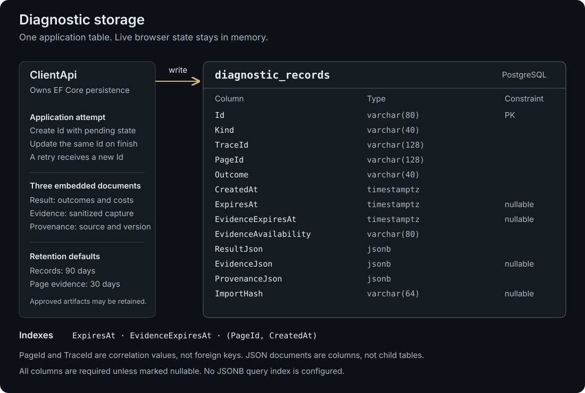

# Backend diagnostics

ClientApi records each application resolution attempt in PostgreSQL so engineers can investigate wrong targets, missing evidence and operational failures. Records survive chat reset and tab closure; they cannot restore a browser session. The standalone evaluator runs without this database.



## Storage and request lifecycle

`diagnostic_records` combines three groups of data:

- **Identity and lookup:** primary key `Id`, `Kind`, `Outcome`, `TraceId`, `PageId`, timestamps and `EvidenceAvailability`.
- **Structured snapshots:** `ResultJson`, nullable `EvidenceJson` and `ProvenanceJson`, all PostgreSQL `jsonb`. Separating evidence lets page content expire before results.
- **Import identity:** nullable `ImportHash` recognizes identical sanitized imports without replacing originals.

Three secondary indexes cover `ExpiresAt`, `EvidenceExpiresAt` and `(PageId, CreatedAt)`. Stable columns support retention and recent-page lookup; JSONB accommodates nested result changes. Detailed analysis requires reading JSON: there are no JSONB search indexes or separate target/model tables. Browser identities are references, not foreign keys; Browser owns the live objects in memory.

`ResolutionRecorder` saves a sanitized `pending` request, calls Resolver with `X-Xpathed-Attempt-Id`, validates response identities, then updates that row with the result and evidence. Evidence includes available model input, prompt, schema and configuration. Web receives the ordinary result. Retries get new attempt IDs; shared usage/cost is stored once per request.

Each save is atomic and has a two-second deadline. No database transaction spans the model call. Storage failure logs `Diagnostic storage unavailable` with `AttemptId`, `TraceId` and `ExceptionType`, without changing the resolution outcome. A crash can leave `pending`; a failed write can leave no durable record. Resolver transport failures record `outcome: "error"`, `diagnostics.stage: "resolver_transport"`, a failure `code` and `missingEvidence: true`, when storage is available.

## Investigate a failed attempt

**Illustrative example:** “click Save in Profile” identifies Billing's Save button.

### 1. Export the original

With the local stack running, substitute the page and attempt IDs:

```sh
rtk pnpm diagnostics -- list PAGE_ID
rtk pnpm diagnostics -- export ATTEMPT_ID > /tmp/diagnostic.json
```

Check `outcome`, `evidenceAvailability`, `result.documentId` and `result.captureId`. Inspect `result.actions` and `result.summary` for individual target outcomes. `list` returns at most 100 retained records, newest first.

### 2. Locate the failure

Follow `result.diagnostics.stage` and `code`, correlating service logs through `TraceId`, `AttemptId` and `ConfigurationId`. Compare `evidence.modelInput` with the returned target: if Profile's button was omitted, investigate capture/context preparation; if supplied but misselected, investigate interpretation and model selection.

- **Operational/contract failure:** transport, provider or invalid-response errors; establish what evidence exists before judging selection.
- **Semantic error:** an independent review confirms the returned target or interpretation is wrong. XPath uniqueness alone cannot establish correctness.
- **`not_found`:** normal scoped absence unless evidence proves an eligible requested target existed in the current view.
- **`partial`:** inspect every target. **`pending`:** investigate incomplete recording rather than scoring model correctness.

Useful diagnostic fields are `capture`, `modelInputComplete`, `timingsMs`, `model`, `provider` and `promptVersion`. Completeness of captured input does not prove completeness of the answer.

`usage` contains received usage; `costEstimate` is separate. When `providerAccounting` is `pending`, a correlated `Late provider accounting` log may later report `GenerationId`, `ReportedUsd` and `AccountingStatus`. It does not rewrite the persisted failure. Missing charges remain unknown, and reconciliation is not restart-safe.

### 3. Add a reviewed regression

Preserve the original export. Reproduce the confirmed mistake in a versioned fixture, independently label the expected target, and add the reviewed case to the shared evaluation collection. Run the relevant deterministic evaluation; paid comparisons remain explicit.

A corrected or imported `regression_fixture` receives a new artifact ID with provenance linking the original. Import does not grade, approve or automatically add an evaluation case. There is no dedicated semantic-error column or review dashboard.

## Privacy and retention

Sanitization excludes form values, recognized credentials, raw provider responses and browser handles; URL credentials, query and fragment are removed. Instructions requesting entered values and related content are redacted, and their model input is withheld. Sanitized page text can still be sensitive: keep exports private. Evidence is not byte-exact provider replay.

Records expire after **90 days**; page evidence after **30 days**. Compose settings are `DIAGNOSTIC_RECORD_DAYS` and `DIAGNOSTIC_CAPTURE_DAYS`; direct settings are `Diagnostics__RecordRetentionDays` and `Diagnostics__CaptureRetentionDays` (1–3650 days).

Cleanup runs at startup and hourly: up to 1,000 expired records deleted and 1,000 evidence payloads cleared per sweep. Reads hide expired data immediately. Ordinary imports cannot extend maximum retention. Reviewed `regression_fixture` and `qualification` records can be retained indefinitely, until explicit deletion.

## Operator reference

The CLI runs inside ClientApi. Success returns JSON; errors return a fixed code and nonzero exit. Alongside `list [PAGE_ID]` and `export ATTEMPT_ID`:

```sh
rtk pnpm diagnostics -- import < /tmp/diagnostic.json
rtk pnpm diagnostics -- prune
rtk pnpm diagnostics -- delete ARTIFACT_ID
```

Internal endpoints are:

- `GET /internal/diagnostics` — optional `pageId`, `traceId`, `limit` (1–100).
- `GET /internal/diagnostics/{id}`
- `POST /internal/diagnostics/import`
- `POST /internal/diagnostics/prune`
- `DELETE /internal/diagnostics/{id}`

They reject browser `Origin` headers and non-loopback remote IPs, and are unavailable through the Web proxy. This is local operator access, without hosted authentication.

### Export format

The envelope contains `version: "1"`, `id`, `kind`, `traceId`, `pageId`, `outcome`, `createdAt`, nullable `expiresAt`/`evidenceExpiresAt`, `evidenceAvailability`, object `result`, nullable object `evidence`, and object `provenance`. Imports are limited to 2 MB and validated; page/model payloads belong only in `evidence`.

Kinds: `resolution`, `evaluation`, `saved_case`, `model_configuration`, `regression_fixture`, `qualification`. Required provenance: `source`, `schemaVersion: "1"`, `codeVersion`, `configurationId`, `caseId`; unavailable values must be explicit. Indefinite retention additionally requires `approved: true`, `reviewedBy`, `reviewedAt` for eligible kinds.

Identical sanitized imports are idempotent. A different payload using an existing ID returns `409 artifact_conflict`.

## Schema changes

EF migrations and the model snapshot live under `src/ClientApi/Data/Migrations`. Local Compose enables `Diagnostics__MigrateOnStartup`; otherwise it defaults off. Migration failure prevents startup. Review migrations and preserve volumes.

`pnpm test:persistence` uses a disposable PostgreSQL server with create-database permission, creating/deleting isolated test databases. It checks schema agreement, persistence, concurrent writes, failures, sanitization, import conflicts and expiry.

Source: [ClientApi diagnostics](../src/ClientApi/Diagnostics/). Related guide: [independent evaluation](evaluation.md).
