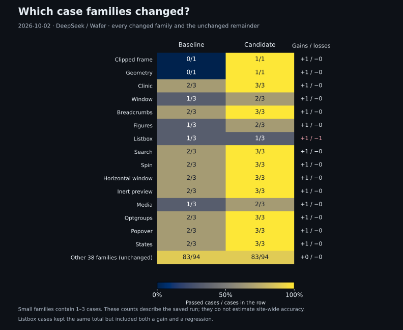

# Engineering decisions

xpathed resolves one English action across targets in the current view. Its design keeps language interpretation measurable, locator verification deterministic and failures available for investigation.

## Give the model a bounded job

The model selects candidate IDs from browser observations. Browser code builds XPath and verifies that it uniquely identifies the selected node. This division prevents invented locator text from becoming the trust boundary.

The remaining uncertainty is explicit: the model may select the wrong element. Independent expected targets measure that error. A disabled intended target can be correctly selected while remaining unavailable for the requested action.

The runtime uses one selection call. The default is DeepSeek V4.1 Flash through OpenRouter's Wafer provider, with reasoning and provider fallback disabled and strict structured output. The choice balances correct target selection, interactive latency and cost. It is not a claim that the model has the highest accuracy on every workload. No model is trained here.

Model, provider, prompt and schema settings form a configuration identity. Evaluate changes together on the same cases before approving them. Detailed comparison records remain in the dated research reports.

## Match the scope to the visible page

The current-view boundary makes “all” inspectable. A plural instruction must return the complete intended set inside that view, including disabled or covered targets. Off-screen controls require manual scrolling and another request.

Capture supplies names, role, structural context, state, geometry and supported CSS colors. It keeps the complete scoped inventory and fails explicitly when resource limits prevent a complete capture. This avoids interpreting a missing candidate as proof that the target does not exist.

## Verify identity, then report readiness

An XPath match must be unique in its whole document and refer to the captured node. Frame identity stays separate because XPath cannot cross documents. Current-view membership is checked again after inference so page changes cannot silently validate stale evidence.

Readiness is a passive observation. A valid locator does not establish event behavior or a successful business action. Execution and postconditions belong to a future runner integration.

Semantic anchors and explicit test attributes are preferred over ordinary IDs and structural paths. Mutation tests check both saved-locator reuse and fresh resolution after page changes; neither promises survival through every redesign.

## Measure each failure at the right boundary

Controlled browser cases define expected nodes independently of model input. They grade capture coverage, exact target sets, action, XPath identity, readiness, privacy and passive state. Deterministic provider responses check pipeline behavior; live runs measure model selections.

Reviewed imported data adds language and page variety. Offline target selection cannot establish live readiness or viewport correctness, so its denominator stays separate. Repeatedly used cases are regression evidence, not unseen-site generalization.

### Saved browser comparison

The October 2, 2026 comparison recorded **119/135 correct candidate responses**, against **105/135** for its baseline. It contained 15 gained passes and one lost pass; the current no-regression gate would reject that loss. Candidate median latency was **1,116.9 ms**, with **1,710.2 ms** p95. These are saved measurements, not a fresh check of this checkout.

One failure illustrates why command grading matters: `release3-listbox-1` selected the correct Greek option but changed the requested `click` to `select`. A correct target and valid XPath did not make the action correct. The [saved comparison record](research/2026-10-01-release-monitoring-setup.md#first-approved-release--2026-10-02) retains the outcomes and charges.

The separate October 1 offline run returned **547/860 exact targets (63.60%)**. Its naming gap—495/657 named targets versus 52/203 unnamed targets—makes capture context a useful investigation area, without isolating a cause. See the [offline report](research/deepinfra-labelled-baseline-report.md).

## Preserve evidence and protect known behavior

ClientApi stores attempts, outcomes, configuration, timings and sanitized evidence in PostgreSQL. Storage problems do not replace semantic results. Investigation starts from the attempt and trace IDs, then separates capture, provider, contract, stale-page and target-selection failures. An operational log alone cannot establish the user's intended target.

Ordinary CI remains provider-free. Release evaluation compares exact candidate and approved images on the same complete collection, with one original attempt per case and no automatic retries. Approval requires no lost baseline pass and valid contract, safety and artifact checks. Latency and cost remain descriptive; missing charges remain unknown.

Activation is explicit. Nightly monitoring repeats approved cases and reports drift without changing the running application. Replay regrades retained evidence; it cannot recreate an arbitrary historical website.

## What to improve next

1. **Target known errors:** naming, relational context, action interpretation and complete target sets. Add reviewed cases and require comparisons that preserve existing passes.
2. **Measure authoring value:** integrate with a test-authoring workflow and measure accepted suggestions, corrections and time to a correct locator.
3. **Extend with separate evidence:** evaluate locator-repair suggestions, failure triage and test drafting while preserving intended targets and assertions.

Business savings and hosted capacity remain unmeasured. The useful advantage would be reviewed evidence about real instructions and page changes, coupled with a release process that protects known behavior.

The [evaluation guide](evaluation.md) and [release runbook](releases.md) contain the operational procedures.
