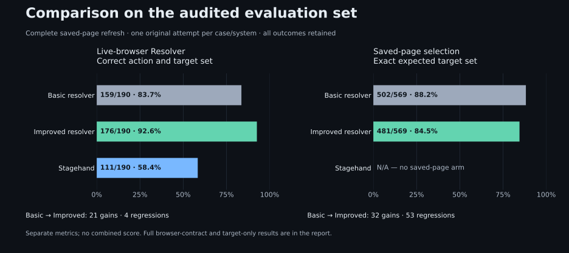

# Refreshed comparison on the audited evaluation set

Historical measurement before the Gemini default refresh. Its original source, scores and aggregate bytes are preserved; see the current comparison for presentation numbers.

Measured on **4 October 2026** against runtime source `d444176cd2351d85336167cd3b9e7b60114bf77e`. Basic retains archived source `d533377945f67f99dbb2d23ab9b2ea04eef61569`; Stagehand is pinned to **4.1.0**. All three browser arms were remeasured on the expanded **190-case** set, including spatial-item and open-shadow cases. Both saved-page arms were refreshed on all **569 admitted cases**. The current source includes the retained-target revalidation changes. Later `main` commit `cd62ec0f7d27451b697f7ff7150b67e6f8ca1b39` changes CI/contribution policy only; runtime, cases and graders are unchanged.

The saved-page results below come from a **fresh complete 2,276-request saved-page run** after the evaluation-key allowance was restored: 569 original attempts each for Basic, Improved, Luna and Gemini, with no spending-limit refusals. The earlier interrupted run remains [separate evidence](comparison-2026-10-04-interrupted.md); its run-success percentages are not substituted for selection accuracy. The pinned application images and runtime/evaluation file hashes are unchanged, while the fresh runner checkout is `dcaa1f5f98e16510ffd0d26cbcbf1e21999809dc`.

Luna and Gemini are separate model-comparison arms, described in the [model report](model-comparison-2026-10-04.md); Gemini uses its required low-reasoning research profile.

The README table and figure use the [same verified aggregate](../assets/evaluation/comparison-2026-10-04-deepseek.json). The [3 October report](comparison-2026-10-03.md) preserves its original 183 browser and 172 XPath cases. Supplementary [spatial pipeline results](spatial-item-selection.md) remain a separate measurement.

## Dataset and measurement boundaries

| Category                            | Cases | Systems                    | Measurement                                                                         |
| ----------------------------------- | ----- | -------------------------- | ----------------------------------------------------------------------------------- |
| Saved-page selection                | 569   | Basic, Improved            | Exact expected target set from reviewed saved inputs; real provider requests        |
| Live-browser comparison             | 190   | Basic, Improved, Stagehand | Correct action and exact target set on independently reset controlled pages         |
| XPath construction and verification | 180   | Current Browser            | Independent DOM identity and locator mutations; controlled provider, no model calls |

The active archive has 569 admitted PhraseNode cases across 171 historical page families: 542 dev, 24 test and three train. The full source inventory remains 1,084 records, with 515 explicit exclusions: 288 insufficient evidence, 218 ambiguous labels and nine contradictory expectations. Every admitted case binds independent input, label and prepared-input hashes. Failures do not shrink the collection.

The browser catalog includes 221 source cases. Paid comparison excludes controlled-provider/mutation cases; XPath evaluation separately excludes cases without a selected target. Their inventories and exclusions remain in the aggregate. Category denominators are never pooled.

## Results

| System            | Saved-page exact-target selection | Browser action + targets |
| ----------------- | --------------------------------- | ------------------------ |
| Basic resolver    | 502/569 (88.2%)                   | 159/190 (83.7%)          |
| Improved resolver | 481/569 (84.5%)                   | 176/190 (92.6%)          |
| Stagehand         | Not applicable                    | 111/190 (58.4%)          |

Saved-page failed outcomes (all retained):

| System            | Incorrect found target set | Not found | Error response | Unsupported response |
| ----------------- | -------------------------- | --------- | -------------- | -------------------- |
| Basic resolver    | 24                         | 13        | 22             | 8                    |
| Improved resolver | 14                         | 11        | 21             | 42                   |

Basic → Improved: **21 gains and 4 regressions** in browser action-and-target correctness; **32 gains and 53 regressions** in saved-page exact-target selection. These paired outcomes use complete new saved-page attempts; the interrupted run is kept separate.

| Browser comparison   | Gains | Lost passes |
| -------------------- | ----- | ----------- |
| Basic → Improved     | 21    | 4           |
| Basic → Stagehand    | 8     | 56          |
| Improved → Stagehand | 1     | 66          |

### Browser scoring boundaries

| System            | Action + targets | Target selection only | Full resolver contract |
| ----------------- | ---------------- | --------------------- | ---------------------- |
| Basic resolver    | 159/190 (83.7%)  | 160/183 (87.4%)       | 145/190 (76.3%)        |
| Improved resolver | 176/190 (92.6%)  | 178/183 (97.3%)       | 171/190 (90.0%)        |
| Stagehand         | 111/190 (58.4%)  | 144/183 (78.7%)       | Not applicable         |

The common score checks action and the exact complete target set, including applicable passive-state and privacy checks. Target-only scoring excludes seven unsupported instructions and checks exact targets or scoped absence without the action name. Full-contract scoring also checks readiness, capture coverage and response details; Stagehand does not expose that contract. Its singleton score uses the first suggestion and its plural score uses the whole returned set without oracle-guided filtering.

Controlled XPath verification passed **180/180**, including **22/22 saved-locator mutations** and **22/22 fresh resolutions after mutation**, with no model calls.

### Browser behavior categories

| Behavior    | Basic         | Improved       | Stagehand     |
| ----------- | ------------- | -------------- | ------------- |
| appearance  | 5/5 (100.0%)  | 5/5 (100.0%)   | 3/5 (60.0%)   |
| cardinality | 2/4 (50.0%)   | 2/4 (50.0%)    | 2/4 (50.0%)   |
| context     | 50/60 (83.3%) | 58/60 (96.7%)  | 45/60 (75.0%) |
| frames      | 1/3 (33.3%)   | 2/3 (66.7%)    | 1/3 (33.3%)   |
| robustness  | 3/3 (100.0%)  | 3/3 (100.0%)   | 1/3 (33.3%)   |
| scope       | 18/25 (72.0%) | 25/25 (100.0%) | 17/25 (68.0%) |
| state       | 49/56 (87.5%) | 48/56 (85.7%)  | 14/56 (25.0%) |
| targeting   | 31/34 (91.2%) | 33/34 (97.1%)  | 28/34 (82.4%) |

### Calls and cost

| Category / system             | Original requests | Known reported USD | Unreported charges | Key-limit refusals |
| ----------------------------- | ----------------- | ------------------ | ------------------ | ------------------ |
| browser / Basic resolver      | 190               | $0.01872161        | 0                  | 0                  |
| browser / Improved resolver   | 190               | $0.02724589        | 0                  | 0                  |
| browser / Stagehand           | 190               | $0.03111618        | 0                  | 0                  |
| savedPage / Basic resolver    | 569               | $0.36691909        | 0                  | 0                  |
| savedPage / Improved resolver | 569               | $0.39201291        | 0                  | 0                  |

Total: **1,708 original provider requests**, **$0.83601567 known reported cost**, plus **0 unknown charges**. Refused requests remain requests; they do not establish completed inference or zero cost. The six provider-free Basic compatibility trials are excluded from paid totals.

### Timing by execution cohort

| Category / system             | Cohort                  | Measured / attempts | Median | p95    |
| ----------------------------- | ----------------------- | ------------------- | ------ | ------ |
| browser / Basic resolver      | parallel                | 190/190             | 0.752s | 1.313s |
| browser / Improved resolver   | parallel                | 190/190             | 0.822s | 1.565s |
| browser / Stagehand           | parallel                | 190/190             | 0.692s | 1.717s |
| savedPage / Basic resolver    | fresh-complete-parallel | 569/569             | 1.172s | 2.183s |
| savedPage / Improved resolver | fresh-complete-parallel | 569/569             | 1.177s | 2.009s |

Browser streams run concurrently in isolated environments; each arm is serial. Saved-page arms run concurrently, serial within each arm. Browser timing measures the resolver/observer request; saved-page timing measures the CLI inference process, excluding preparation. The new saved-page run contains no spending-limit refusals. Timing remains specific to its execution cohort and is not a clean cross-model latency ranking.

### Case examples

The four lost Basic browser passes remain explicit:

- `context-grid-cell-for-focus`
- `state-checked-watering-checkbox-uncheck-is-ready`
- `state-readonly-summary-clear-is-blocked`
- `targeting-preview-edition-button`

Every browser and saved-page gain, regression, failure category and original trial hash is retained in the public aggregate. Saved-page instructions and provider payloads remain private.

## Matched conditions

All system-comparison arms use DeepSeek V4.1 Flash through OpenRouter's Wafer provider, reasoning disabled, fallback disabled and a 4,096-token output allowance. One original attempt per case and arm was retained, without response reuse. Original provider and model-output failures count as failures.

Basic and Improved receive identical reviewed saved-page inputs and expectations. Basic retains its historical prompt; Improved uses one current prompt/schema across browser and saved-page selection. The browser arms share instructions, reset fixture state, viewport and Chromium binary; each system prepares its own context. Stagehand uses stock `observe`, its own snapshot, prompt and selector generation. No arm executes the requested action.

Basic uses its archived native Browser and Resolver images. An envelope adapter supplies only the archived contract selector and preserves its native request/response. Six controlled compatibility trials verified singleton, plural and absence behavior before paid inference. Improved uses the same pinned Resolver image in both categories.

## Evidence and reproduction

| Evidence                     | Run ID                               | Manifest SHA-256                                                 |
| ---------------------------- | ------------------------------------ | ---------------------------------------------------------------- |
| Browser comparison           | 43cbd0cb-1373-4045-9d8b-5a90328fd1f3 | 3b9f75f8cefc2c33b08f4af1ef356f507ecc96201fda100414f324b4f8211ead |
| Saved-page Basic resolver    | 5c9c59c5-bad3-4dbc-90f9-e6a883400345 | 47f5cad9e4a7e371a375a27ecbb0e3e48d35440a24c94cf19b1248b306d00c33 |
| Saved-page Improved resolver | 99209703-579d-48cf-ac5d-f40d4219b00d | 68f941f6a8279e045f7f2951cc1187a94150654a338609343cd8547b10a4d5b9 |
| XPath verification           | 9194a95c-e2ea-482c-ba0c-fb9a241a08bc | a296e5aa6c599bad18b25357e155fbbb7b0bbc6ffecc83d91a2e931283ec5248 |

The active archive SHA-256 is `ca9c2dd8e5fbf5a6bc48b80fcc863113eff771f9a726858f3f9386f2a39080ae`; the full review SHA-256 is `f7233682af26dd85c34d1904504cf9542454a398a318ffc3d0738cd0c8fa5fbb`. The shared saved-page plan hash is `efd4440d689898fee54e9a9ecdbefe52a68b01b6b70a313c4d81a654954cbc18`. The aggregate binds complete source/image identities, preparation receipts, matched settings, independent expectations, grader identities and evidence hashes.

The Basic runtime receipt is explicitly marked **completed-run-image-restoration**: the original launcher omitted a contemporaneous container receipt. Pinned images were restored after completion without new inference, and every original manifest/trial/provider file was checked against a complete pre-restoration hash snapshot. This supports artifact identity but is not contemporaneous container evidence. Its receipt phase and snapshot hash remain public.

The existing graders replayed all browser, saved-page and XPath outcomes; the export verified complete case membership, prepared-input review bindings, provider identity and cache protections, charges and summaries. Local fake-provider checks verified the actual CLI request binding and rejected changed input, prompt or schema with no external calls. Calculation-only reconciliation helpers remain private; the aggregate records their hashes. The [figure guide](../assets/evaluation/README.md) describes provider-free regeneration from retained evidence.

The [model comparison](model-comparison-2026-10-04.md) uses this current Improved runtime and the same case definitions, prompt/schema and reviewed inputs. DeepSeek reference results are shared evidence, not additional requests or cached responses.

## Limits

These audited cases include previously observed failures; they are not a blinded held-out estimate. Authored browser pages cover defined behaviors, while historical saved pages do not establish live viewport, XPath or readiness correctness. One attempt leaves sampling variation unresolved, and hosted models can change independently of model names. System changes and provider conditions are not isolated causally. Complete fresh-run scores remain descriptive; differences cannot isolate the causal contribution of prompt changes or hosted-model sampling. Higher aggregate success does not override lost baseline passes or establish release approval, deployment or unseen-site accuracy.
