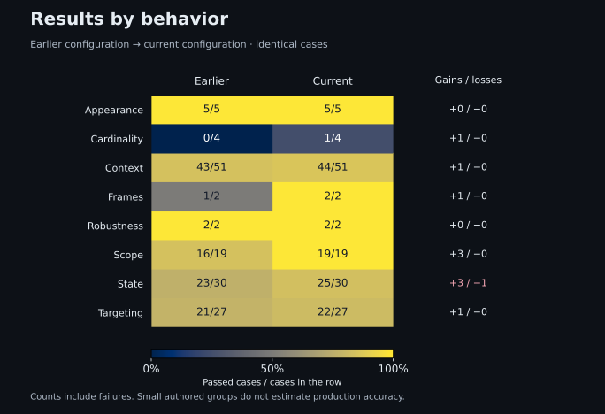

# Basic and Improved resolver: historical comparison

For the frozen audited-set measurements from 3 October 2026, use the [recorded three-system comparison](clean-evaluation-comparison.md). Later spatial-item changes have a [separate pipeline check](spatial-item-selection.md). This report preserves its original historical evidence.

**Historical comparison — 2 October 2026.** The saved-page scores below use the original collection before later semantic, prepared-input, uniqueness and instruction-contract audits excluded invalid expectations. They are not the clean-dataset baseline. Original scores and evidence remain unchanged; see the [active dataset contract](../evaluation.md#private-dataset-collection).

On the same complete collection, browser passes rose from **111 to 120 out of 140**, with ten gained passes and one lost pass. Saved-page selection was **716 versus 710 out of 1,084** under the same prompt and configuration. Every planned case received one attempt per arm.

## What changed

Both arms use `deepseek/deepseek-v4.1-flash` through OpenRouter's Wafer route, with 4,096 output tokens, reasoning disabled and no provider fallback.

| Area                            | Basic resolver                       | Improved resolver                                                                                                  |
| ------------------------------- | ------------------------------------ | ------------------------------------------------------------------------------------------------------------------ |
| Live-browser Resolver selection | Initial current-view setup           | Explicitly distinguishes requested controls from their surrounding containers and repeated text                    |
| Missing targets                 | Scoped absence instructions          | Explicitly handles empty captures and missing candidates; completeness means every requested target has an outcome |
| Live verification               | Captured targets and viewport checks | Rechecks current-view candidate membership and rejects newly off-screen selected targets                           |
| Saved-page selection            | Earlier saved-page selection         | The same saved-page selection implementation                                                                       |

The browser comparison measures these changes together. The unchanged saved-page path checks behavior under the same selection implementation; model calls can still produce different outcomes. See the [selection prompt](../../src/Resolver/Services/ActionSelectionStrategy.cs) and [verification contract](../resolution.md#current-view-boundary).

## How the comparison works

Each case receives one current-config attempt followed by one earlier-config attempt. Both arms use the same frozen inputs, independent labels and grader. Browser state resets separately. Saved-page inputs retain all candidates supplied by the reviewed adaptation and the original PhraseNode target label. Saved-page selection cannot establish live XPath or readiness correctness, so the tracks have separate denominators.

Execution preserves completed work across two phases:

| Phase        | Case pairs assigned | Execution                                              |
| ------------ | ------------------: | ------------------------------------------------------ |
| Initial run  |                 442 | Completed serially; original evidence retained         |
| Continuation |                 782 | Up to eight workers; only previously unattempted pairs |

Both phases use the same images, inputs and grading rules. Each pair keeps its original attempts; there are no retries or replacements after failures.

Provider response reuse is disabled; prompt caching is allowed. Fixed current-first ordering can warm the cache for the second arm. An independent eight-worker Jev study also shared the host, with separate browser ownership and accounting locks. Latency describes these conditions.

## Results

| Track                             | Cases per arm | Basic passes | Improved passes | Gained passes | Lost passes |
| --------------------------------- | ------------: | -----------: | --------------: | ------------: | ----------: |
| Live-browser Resolver             |           140 |  111 (79.3%) |     120 (85.7%) |            10 |           1 |
| Saved-page selection (PhraseNode) |         1,084 |  716 (66.1%) |     710 (65.5%) |            78 |          84 |

The browser gain is 6.4 percentage points. The one regression, [`release3-listbox-3`](../../evaluation/cases/state.json), asks to click an absent option. Both configurations correctly report `not_found`, but the current one changes the action from `click` to `select`. Correct absence does not excuse changing the command.

The saved-page prompt, its configuration identity and implementation are unchanged. The 78 gains and 84 losses show variation across repeated calls; they do not demonstrate a saved-page improvement from the browser changes. Failed attempts remain in every denominator.

Fourteen saved-page attempts exceeded the Resolver’s 30-second provider timeout: ten current and four earlier. These timeouts cause the saved `infrastructure_failure` status. Another 65 malformed responses and 76 incomplete decompositions count as model-output failures in the scores; they do not trigger that infrastructure classification. Lost passes also violate the no-regression rule. This research run retains every outcome and does not approve or activate a release.

### Latency and cost

Latency below is median / p95 in seconds, within matched execution cohorts. Browser time measures the Resolver HTTP response; saved-page time includes CLI process startup and excludes input preparation.

| Track / phase                        | Cases per arm | Basic resolver | Improved resolver |
| ------------------------------------ | ------------: | -------------: | ----------------: |
| Live-browser Resolver / serial       |            69 |  0.886 / 1.250 |     0.624 / 0.871 |
| Live-browser Resolver / continuation |            71 |  1.040 / 1.718 |     0.621 / 1.098 |
| Saved-page selection / serial        |           373 |  0.910 / 4.346 |    1.082 / 11.530 |
| Saved-page selection / continuation  |           711 |  1.065 / 6.190 |     1.230 / 5.836 |

The run forwarded **2,448 provider calls**, with **$1.31232595 in known charges and four unavailable charges**. Browser calls cost $0.01245089 earlier and $0.01302741 current. Saved-page calls cost $0.58211627 earlier and at least $0.70473138 current; the four unknown charges belong to the current saved-page arm. Estimates remain separate in the [aggregate evidence](../assets/evaluation/configuration-comparison.json).

## Evidence provenance

The Basic browser uses the initial current-view prompt; the Improved browser adds the control/context and scoped-absence rules described above. Both archived saved-page arms share the earlier saved-page prompt. Their manifests and recorded source revisions preserve the exact prompts. The new resolver comparison uses the current checkout and includes Stagehand; this historical report retains its original two arms and collection.

The fresh run began on 2026-10-02 with run ID `a2fe5484-bc80-472a-a5c9-c1c1cb7bf8e8`. Its manifest freezes the case inputs, image identities and policy before inference.

The continuation used runner revision `4816350c139834deb621ebb009b6d36fee1d92bb` with the original images. The aggregate records source, manifest, per-case and trial hashes, image identities and execution phases; private page inputs and provider payloads are excluded.

| Identity                | Basic resolver                                                     | Improved resolver                                                  |
| ----------------------- | ------------------------------------------------------------------ | ------------------------------------------------------------------ |
| Source commit           | `d533377945f67f99dbb2d23ab9b2ea04eef61569`                         | `66488a4e7baa9af536262fbb1d5aeadcd34fcf1f`                         |
| Bundle manifest SHA-256 | `7e67bfe34c640750fe21668b4eeebdf32a13353a70057bb341a3bb1b78fcd586` | `defc3b3bc3ee8a3f49eb09283966f3f7ea4c4c75ccb35e1616ce96463633c25e` |

The earlier bundle was rebuilt from preserved source; its image IDs differ from the original 135-case measurement. Those measurements are excluded. The reviewed PhraseNode archive is pinned to SHA-256 `72d140c1c5d4ef9032277ce9422f6f4039c6c864f166b3a6572078576db82d86` in the [collection definition](../../evaluation/datasets/collection.json).

A separate aborted run retained 22 complete pairs and one additional current-config call after a provider transport timeout. Its 45 forwarded calls incurred **$0.02295176 in known charges, with one charge unavailable**. Its results and charges remain separate from this comparison.
