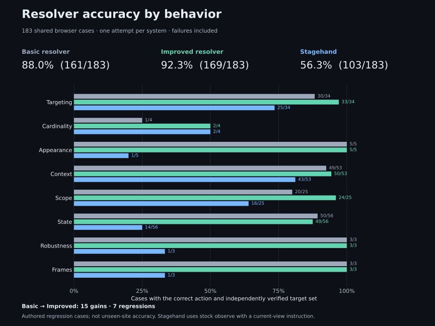

# Basic resolver, Improved resolver and Stagehand

## Results

All three systems received the same frozen browser evaluation cases and independent target labels, with one original attempt per case and no retries. This authored evaluation set measures performance on these cases; it does not estimate accuracy on unseen websites.

| System            | Action + targets | Target selection only | Full resolver contract | Parallel median / p95 |  Known cost | Unreported charges |
| ----------------- | ---------------: | --------------------: | ---------------------: | --------------------: | ----------: | -----------------: |
| Basic resolver    |  161/183 (88.0%) |       160/175 (91.4%) |                147/183 |       0.599s / 1.060s | $0.01656773 |                  0 |
| Improved resolver |  169/183 (92.3%) |       169/175 (96.6%) |                155/183 |       0.581s / 0.793s | $0.01741879 |                  0 |
| Stagehand         |  103/183 (56.3%) |       136/175 (77.7%) |            Unavailable |       0.572s / 7.849s | $0.03913768 |                  0 |

Basic → Improved: **15 gained passes and 7 lost passes**.

## What each system uses

The comparison holds the instruction, fixture state, browser environment, model/provider route and output allowance constant. Each system prepares its own model context and interprets its own output.

| Boundary             | Basic resolver                                                                                                                  | Improved resolver — selected in `main`                                                                                                                              | Stagehand                                                                                                                                        |
| -------------------- | ------------------------------------------------------------------------------------------------------------------------------- | ------------------------------------------------------------------------------------------------------------------------------------------------------------------- | ------------------------------------------------------------------------------------------------------------------------------------------------ |
| Page input           | Browser-owned current-view capture, including supported nested frames                                                           | Same current-view capture architecture                                                                                                                              | SDK-owned page snapshot for stock `observe`                                                                                                      |
| Model context        | Sanitized candidate IDs, names/text, roles, section/row context, compact state, geometry, supported CSS colors and frame labels | Same evidence types, with one shared runtime/saved-page prompt and schema                                                                                           | Stagehand's snapshot representation, observation prompt and schema; receives the instruction prefixed with a current-viewport constraint         |
| Selection rules      | Initial current-view prompt already supports one shared action, plural targets, scoped absence and unsupported instructions     | Adds explicit distinctions between requested controls and scope containers/repeated text; clarifies missing candidates, empty captures and enumeration completeness | Stock observation proposes methods, arguments and element IDs; SDK maps those IDs to selectors                                                   |
| Locator construction | Browser builds semantic XPath from retained DOM nodes and verifies uniqueness and same-node identity                            | Same Browser-owned construction, plus revalidation of current-view candidate membership and rejection of newly off-screen targets                                   | SDK returns generated selectors; our adapter splits supported frame paths into document XPaths and the independent grader checks target identity |
| Result               | Shared action, target outcomes, XPath, frame context, passive readiness and request cost                                        | Same response contract                                                                                                                                              | Suggested actions/selectors; no xpathed readiness, coverage or per-missing-target explanation contract                                           |
| Execution            | Passive resolution and highlights                                                                                               | Passive resolution and highlights                                                                                                                                   | `observe` only; `act`, self-healing and response reuse disabled                                                                                  |
| Reproduction         | Verified archived Browser/Resolver image bundle                                                                                 | Tested source and exact image identities in the run manifest                                                                                                        | Pinned SDK adapter and lockfile in the run manifest                                                                                              |

All three used DeepSeek V4.1 Flash through Wafer, reasoning disabled, no provider fallback and a 4,096-token output limit. No system received the grader's expected selectors. Basic already had model selection and browser verification; Improved changes their rules and validation. These changes were measured together, so the scores cannot attribute an improvement to an individual rule. Stagehand's own representation and prompt make this a comparison of complete systems.

The [archived Basic source](https://github.com/Mochib-Tech-Solutions/xpathed/tree/d533377945f67f99dbb2d23ab9b2ea04eef61569), [selected prompt](../../src/Resolver/Services/ActionSelectionStrategy.cs), [candidate serializer](../../src/Resolver/Services/CandidateInput.cs), [Stagehand adapter](../../evaluation/research/stagehand-server.mjs) and [selector normalization](../../evaluation/research/stagehand.mjs) define these boundaries. Recorded image/source identities in the aggregate identify what actually ran.

## Case examples

These are original outcomes from the saved comparison, displayed under today's behavior-based case names. `sourceIds` links each name to its original evidence ID. Pass/fail below refers to the common action-and-target score.

| Case / instruction | Expected result | Basic | Improved | Stagehand |
| --- | --- | --- | --- | --- |
| `targeting-save-button-by-name` — “Click Save changes.” | Click the labelled Save button | Pass | Pass | Pass |
| `cardinality-all-approval-buttons-include-disabled-target` — “Click all Approve buttons in Approvals.” | Both Approve buttons, including the disabled one | Pass | Pass | Pass |
| `scope-offscreen-target-is-absent` — “Click Help.” | No current-view target | Pass | Pass | Fail: target set differs |
| `state-disabled-spinbutton-click-is-blocked` — “Click Reserved copies.” | Select the disabled spinbutton; readiness remains blocked | Fail: no usable resolution | Pass | Pass on action/target selection |
| `state-listbox-option-for-click` — “Click the Greek option in Available languages.” | Select the Greek option and preserve `click` | Pass | Fail: correct target, wrong action | Pass |
| `context-control-in-collapsed-accordion-is-absent` — “Click Express courier.” | Scoped absence while the accordion is collapsed | Pass | Fail: unsupported result | Pass |

The plural common-score pass does not establish Stagehand readiness. The full Resolver score additionally requires the disabled button to be found with blocked readiness. Likewise, the Greek-option example passes target selection for all three systems while failing the common score for Improved.

All seven Basic→Improved regressions remain visible: `targeting-repeated-target-mention-is-deduplicated`, `context-clinic-visit-type-for-select`, `context-control-in-collapsed-accordion-is-absent`, `context-missing-annotation-link-is-absent`, `state-listbox-option-for-click`, `state-attachment-upload-is-ready`, `state-readonly-summary-clear-is-blocked`. The [aggregate evidence](../assets/evaluation/engineering-comparison.json) retains every original outcome and failure reason. The [evaluation guide](../evaluation.md#example-cases-and-metrics) adds XPath mutation examples and category-specific metric boundaries.

## What the score means

The common score requires the correct interaction and complete set of independently labelled nodes. Each XPath must identify one eligible node. Singleton grading keeps the first Stagehand suggestion; plural grading checks the whole returned set. Wrong, missing, extra and duplicate targets fail. Operational errors remain in the denominator. Correct rejection of unsupported instructions is included; an adapter selector-conversion failure is not a correct instruction refusal.

The target-selection column separately checks exact node sets and correct absence, without requiring the interaction name. Its denominator excludes the explicitly unsupported-instruction cases, which do not have a supported target set. All errors within that subset still fail. This helps distinguish selecting the wrong element from interpreting the action differently.

Stagehand returns targets without xpathed's absence explanations or readiness contract. For an empty result, action interpretation is unavailable; the common score accepts correct absence. For a partly absent request, the common score checks the complete found set. The separate full resolver score also checks outcome details, capture coverage, readiness and summary fields. Neither system executes actions.

## Timing and evidence

Each system has its own serial worker; the three workers run concurrently with isolated browser sessions and provider accounting. Stagehand waits for the corresponding Basic browser observation to establish parity. Browser setup and independent grading are outside the measured inference interval. Timings above describe the parallel phase; retained serial attempts have separate timing fields in the aggregate. Provider caching and host contention can affect timings. Costs are reported amounts, with missing billing records kept separate.

Run: `b74b6e9f-695c-42f8-bc90-d826992a062d`; started `2026-10-02T19:54:47.421Z`. The [aggregate evidence](../assets/evaluation/engineering-comparison.json) records source and image identities, case outcomes and original evidence hashes. Private request/response payloads remain in the local run directory.

The initial runner stopped after one case per arm because it reused an attempt ID. Those three original outcomes remain included. Continuation ran only the remaining cases after the bookkeeping fix. Docker build-attestation wrappers changed during restart; saved build logs verify identical platform manifests and runtime configurations. Original and continuation image identities and the original manifest are retained in the evidence. No failed model attempt was retried.

This research comparison does not approve or activate a release. See [evaluation commands](../evaluation.md#resolver-comparison) to reproduce it.
