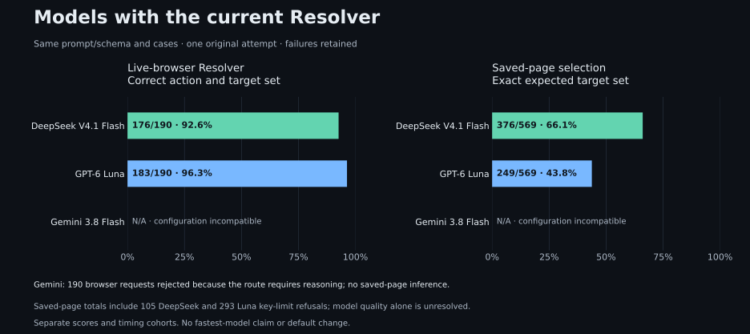

# Current Resolver model comparison — 4 October 2026

This refresh holds current runtime `d444176cd2351d85336167cd3b9e7b60114bf77e`, the prompt/schema, browser fixtures and all 569 reviewed saved inputs fixed while changing the model, pinned provider and required reasoning settings. It uses the same 190 browser cases as the [system comparison](clean-evaluation-comparison.md). DeepSeek reference results are reused for reporting, with no additional inference. This measured run did not change the application default. The owner subsequently selected the measured Gemini profile as the development default; runtime now supplies its low-reasoning settings directly. The recorded source/image identities and scores below remain the original evidence, including seven saved-page losses against DeepSeek; this choice does not qualify a release.

The saved-page table uses a **new complete run** for each compatible arm, with zero spending-limit refusals. [Earlier interrupted model results](model-comparison-2026-10-04-interrupted.md) remain separate historical evidence. Gemini was freshly tested on all 190 browser and 569 saved-page cases using its required reasoning setting. Its earlier 190 configuration rejections remain separate evidence.

## Results

| Model / pinned provider                              | Browser action + targets | Saved-page exact-target selection |
| ---------------------------------------------------- | ------------------------ | --------------------------------- |
| DeepSeek V4.1 Flash / Wafer                          | 176/190 (92.6%)          | 481/569 (84.5%)                   |
| GPT-6 Luna / OpenAI                                  | 183/190 (96.3%)          | 512/569 (90.0%)                   |
| Gemini 3.8 Flash / Google AI Studio (reasoning: low) | 190/190 (100.0%)         | 547/569 (96.1%)                   |

Browser full-contract success is **171/190** for DeepSeek, **182/190** for Luna and **190/190** for Gemini. DeepSeek → Luna has **8 browser gains and 1 lost pass**. Saved-page exact-target selection has **59 gains and 28 lost passes**, on all 569 new saved-page attempts, with original selection/response failures retained. Paired case lists and original hashes are in the [aggregate](../assets/evaluation/model-comparison.json).

| Paired comparison | Browser gains / lost passes | Saved-page gains / lost passes |
| ----------------- | --------------------------- | ------------------------------ |
| DeepSeek → Luna   | 8 / 1                       | 59 / 28                        |
| DeepSeek → Gemini | 14 / 0                      | 73 / 7                         |
| Luna → Gemini     | 7 / 0                       | 45 / 10                        |

## Settings and compatibility

All profiles use standard pinned OpenRouter routes, provider fallback disabled and a 4,096-token allowance: `deepseek/deepseek-v4.1-flash` / `wafer`, `openai/gpt-6-luna` / `openai`, and `google/gemini-3.8-flash` / `google-ai-studio`. DeepSeek and Luna disable reasoning. The observed Gemini route requires reasoning; its research profile enables low effort and excludes reasoning from returned text. A private evaluation proxy changes only that request field and retains native/upstream request hashes for every trial. Runtime images, prompts, inputs, schemas and graders are unchanged. This compares compatible model/provider profiles rather than identical reasoning settings. The measured application revision disabled reasoning; its earlier 190 Gemini HTTP 400 rejections are retained separately and never scored as model accuracy.

Official route metadata was captured on 4 October: [DeepSeek endpoints](https://openrouter.ai/api/v1/models/deepseek/deepseek-v4.1-flash/endpoints), [Luna endpoints](https://openrouter.ai/api/v1/models/openai/gpt-6-luna/endpoints), [Gemini endpoints](https://openrouter.ai/api/v1/models/google/gemini-3.8-flash/endpoints). The [official models metadata](https://openrouter.ai/api/v1/models) advertises mandatory Gemini reasoning and supports low effort; [reasoning documentation](https://openrouter.ai/docs/guides/best-practices/reasoning-tokens) explains the parameter. Retained actual requests and responses verify the compatible research profile.

## Accounting and timing

| Category / profile   | Original requests | Known reported USD | Unreported charges | Key-limit refusals |
| -------------------- | ----------------- | ------------------ | ------------------ | ------------------ |
| browser / deepseek   | 190               | $0.02724589        | 0                  | 0                  |
| browser / luna       | 190               | $0.02398588        | 0                  | 0                  |
| browser / gemini     | 190               | $0.38011650        | 0                  | 0                  |
| savedPage / deepseek | 569               | $0.39201291        | 0                  | 0                  |
| savedPage / luna     | 569               | $0.80658189        | 0                  | 0                  |
| savedPage / gemini   | 569               | $6.09355050        | 0                  | 0                  |

Across both reports there are **3,226 unique original provider requests**, **$8.14025044 known reported cost** and **0 unreported charges**. This counts shared DeepSeek results once. The earlier 190 Gemini configuration rejections and 1,707 interrupted saved-page requests remain separate historical evidence; they are excluded from these current selected-run totals. Their missing billing metadata is not proof of zero cost. No original attempt was retried or replaced.

| Profile / category | Cohort                          | Median | p95    |
| ------------------ | ------------------------------- | ------ | ------ |
| luna / browser     | interleaved-two-models          | 1.446s | 2.378s |
| gemini / browser   | gemini-compatible-low-reasoning | 1.397s | 2.004s |
| luna / savedPage   | fresh-complete-parallel         | 1.480s | 2.325s |
| gemini / savedPage | gemini-compatible-low-reasoning | 1.673s | 2.550s |

DeepSeek browser timings come from the separate concurrent three-system cohort. Luna browser attempts use the earlier interleaved cohort; compatible Gemini browser attempts run in a fresh serial cohort, with identical per-case inputs and reset environments. Saved-page streams run concurrently, serial within each stream. All complete saved-page timing cohorts remain descriptive and do not establish the fastest model. Reasoning overhead belongs to the Gemini profile. Luna and Gemini each execute one serial saved-page stream; copied collector metadata declaring two workers is preserved separately alongside this execution reconciliation.

## Evidence and grading

The private model collector omitted `strategy` and the top-level model-call count in the common-grader envelope. Regrading restores only `strategy=custom` and the already retained native `diagnostics.modelCalls`; original requests, responses, trial files and full-contract grades are unchanged. The original recorded grades are verified and retained alongside corrected common scores. Actual native request inputs, system prompts and schemas match between paired browser models, including cases whose diagnostic input was redacted or omitted.

All 190 Luna and 190 compatible Gemini browser attempts, 569 saved-page attempts per model, and the earlier 190 rejected Gemini attempts are retained, with zero retries. DeepSeek browser and saved-page results are shared with the system report. Every saved-page input, expected label and prepared-input review hash matches the same admitted collection as DeepSeek. The actual native CLI request binding was checked locally before inference. The aggregate records original trial/provider hashes, collector/exporter identity, manifests, complete paired outcomes and explicit unavailable measurements. Raw payloads remain private. Provider identity, cache and evidence-integrity checks passed; billing availability does not affect grades.

These results are descriptive observations on one audited set. Browser gains do not establish unseen-site quality, release approval or a new preferred default. The compatible saved-page arms completed the entire reviewed set; that does not establish unseen-site quality.
